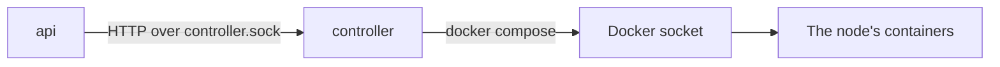

# The controller

The controller is the node's own service, written in Go
([decision #4](../shared/docs/decisions/README.md#register)). It drives the
node's stack with `docker compose` through the Docker socket
([decision #142](../shared/docs/decisions/README.md#register)) and answers
the api over a Unix socket.

For now it does one thing: it reports the status of every service of the
stack. Updates, backups, secrets and certificates come in later steps.

## How it is reached

The controller does not listen on the network. It has no network at all
(`network_mode: none`) and serves HTTP with JSON on a Unix socket only
([decisions #78 and #154](../shared/docs/decisions/README.md#register)).



| What | Value |
|---|---|
| Socket | `/run/titan-controller/controller.sock`, in the named volume `controller-socket` |
| Socket file | Mode `0660`, owner `10002` (the controller), group `10001` (the api's) |
| Socket folder | Mode `0750`, owner `10002`, group `10001` |
| Who shares the volume | The controller, and the api read-only; no other container |

The api calls the controller only for the owner, after its own access
check. Access to the Docker socket amounts to root on the machine, so the
controller runs as a user without capabilities, on a read-only file system,
with 64 MB of memory.

## API

### `GET /health`

The status of every service of the node's stack, sorted by name. The
controller compares the services the stack should have,
`docker compose config --format json`, with their containers,
`docker compose ps --all --format json`
([decision #155](../shared/docs/decisions/README.md#register)). A container
of a service that is no longer in the compose file is left out.

`200`, `application/json`:

```json
{
  "services": [
    {"name": "api", "status": "healthy"},
    {"name": "controller", "status": "running"},
    {"name": "db", "status": "healthy"},
    {"name": "migrate", "status": "done"},
    {"name": "nginx", "status": "healthy"}
  ]
}
```

A service without a container is `down`. With no services in the compose
file, `services` is an empty list: `{"services":[]}`.

`502`, `application/json`, when `docker compose` fails or its output cannot
be read. The message is short and fixed; it never carries compose's or the
parser's error, which go to the controller's log.

```json
{"error": "a short message"}
```

### Statuses

A status comes from the container's state, its healthcheck and its exit code
as compose reports them, and from the service's `restart` policy in the
compose file.

| Status | Meaning | From compose |
|---|---|---|
| `healthy` | Running, and its healthcheck passes | `State` `running`, `Health` `healthy` |
| `running` | Running, and it has no healthcheck | `State` `running`, `Health` empty |
| `starting` | Running, and its healthcheck has not passed yet | `State` `running`, `Health` `starting` |
| `unhealthy` | Running, and its healthcheck fails | `State` `running`, `Health` `unhealthy` |
| `done` | A one-off service, such as `migrate`, finished | `State` `exited`, `ExitCode` 0, and `restart` not `always` or `unless-stopped` |
| `down` | Not running as it should | No container; `exited` with 0 while `restart` is `always` or `unless-stopped`; `exited` with another code, `restarting`, `dead`, `created`, `paused` or `removing` |
| `unknown` | A state or health the controller does not know, such as one a newer Docker adds | Anything else |

## Secret store

`secrets/` in the node folder holds the node's secrets, one file each
([decisions #77, #163](../shared/docs/decisions/README.md#register)). The folder belongs to the controller's user,
`10002`, with mode `0700`, so no other user of the machine can enter it; the
files are mode `0644`, since compose mounts each into containers that run as
other users. It is the one folder the controller mounts writable.

`secrets init` creates every secret the controller generates and is missing,
and keeps those that exist, so running it again is safe. Run it once before
the stack first starts, since compose mounts the files when it creates the
containers:

```sh
docker compose run --rm --no-deps controller secrets init
```

| Secret | What it is | Created by |
|---|---|---|
| `db_password` | The database password, read by db, api and migrate | `secrets init`: 32 random bytes in hex |
| `claude_token` | The Claude token the api uses for now | Whoever installs the node |

A secret is written to a temporary file and linked into place, so an
interrupted run leaves no half-written secret. Its value is never logged.

## Configuration

The controller reads its settings from the environment and refuses to start
when one is missing. The node's `compose.yaml` sets them.

| Variable | What it is | On a node |
|---|---|---|
| `TITAN_NODE_DIR` | The node folder, mounted read-only at the same path as on the machine ([decision #148](../shared/docs/decisions/README.md#register)) | `/opt/titan` |
| `TITAN_COMPOSE_PROJECT` | The compose project name | `titan` |
| `TITAN_CONTROLLER_SOCKET` | The path of the socket it serves on | `/run/titan-controller/controller.sock` |

`compose.yaml` takes `TITAN_NODE_DIR`, `TITAN_CONTROLLER_IMAGE` and
`DOCKER_GID`, the group that owns `/var/run/docker.sock` on the machine, from
the node folder's `.env`. The controller reads the node folder as its own
user, `10002`:

- The node folder and `.env` must be readable by `10002`; mode `0755` for
  the folder and `0644` for `.env` will do. Without `.env`, compose cannot
  fill in the variables `compose.yaml` requires, and every command fails.
- `.env` must hold no secrets: compose quotes its lines in error messages,
  which reach the controller's log. Secrets live in `secrets/`.

The controller logs JSON lines to standard output, never secrets.

## Image

`Dockerfile` builds a static binary with Go and puts it on the official
`docker` CLI image, which holds `docker` and the compose plugin. Both base
images are pinned by digest. The image runs as `10002:10001`.

```sh
docker build -t titan-controller .
```

## Code

| Path | What it is |
|---|---|
| `cmd/titan-controller/` | `main`: settings, the socket, the HTTP server, shutting down on `SIGTERM` |
| `internal/compose/` | `Runner`, the one way to run `docker compose`; tests pass a fake ([decision #156](../shared/docs/decisions/README.md#register)) |
| `internal/health/` | `Parse`: compose's output to services and statuses |
| `internal/server/` | `Health`: the `GET /health` handler |
